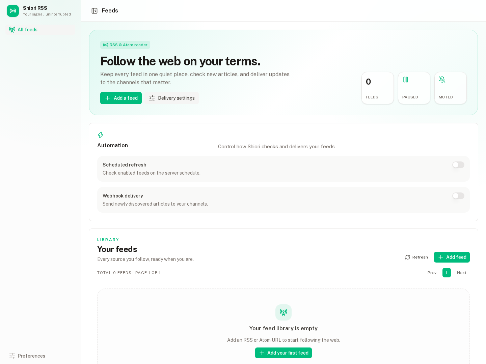
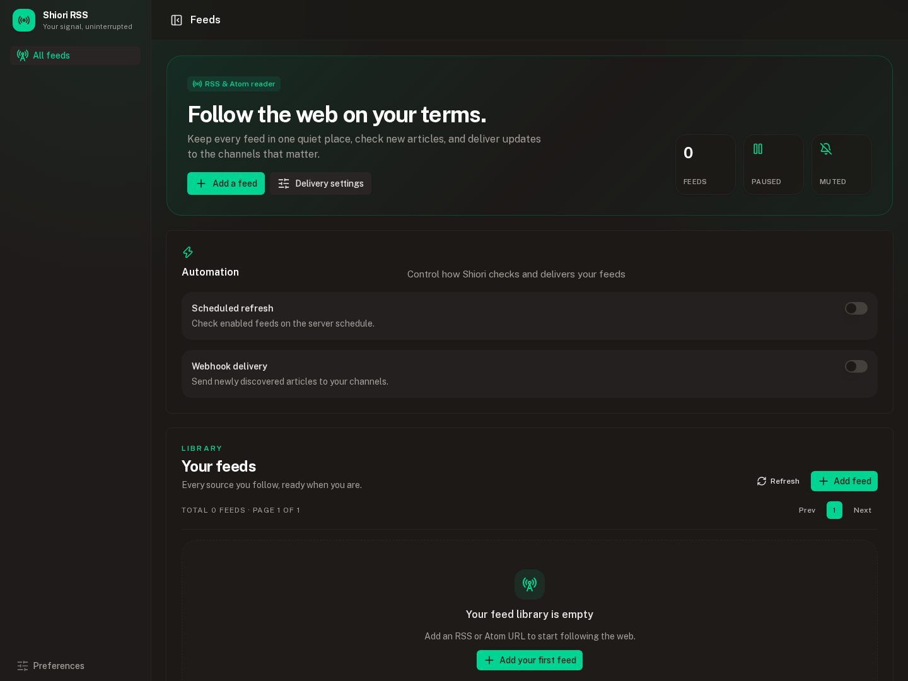

# Shiori Feed

RSS / Atom フィードの購読、記事履歴、Webhook 通知に特化したセルフホストアプリです。

## Install

```bash
docker pull ghcr.io/kai17-a/shiori-feed:latest
docker run --rm -p 3000:3000 -p 8000:8000 \
  -e DATABASE_URL=/data/data.db \
  -e RSS_CRON_SCHEDULE="0 * * * *" \
  -v "$(pwd)/data:/data" \
  ghcr.io/kai17-a/shiori-feed:latest
```

起動後、`http://127.0.0.1:3000` を開きます。`RSS_CRON_SCHEDULE` は cron 式、`TZ` はスケジュールのタイムゾーンです。

## Features

- RSS / Atom フィードの登録、編集、削除
- LLMによる記事一覧ページ解析とカスタムRSSの登録、再解析
- フィードごとの記事履歴、タイトル検索、公開日絞り込み
- フィードの手動実行と cron による定期実行
- Webhook未登録時の記事保存と、登録後の未通知記事配信
- Discord、Slack、Microsoft Teams Webhook への新着通知
- フィードごとの通知先選択と重複通知防止
- 通知への記事概要の有無、ライト・ダーク・システムテーマ設定
- Ollama、vLLM、OpenAI互換LLMの接続設定と疎通テスト
- 保存済み記事のAI事前解析と、定期・手動実行

## Screens

- `/`: フィード数・未通知数のサマリーとアクセス時点から直近24時間のニュース
- `/feeds`: 通常フィードのライブラリ、登録・手動取得
- `/custom-feeds`: LLMカスタムRSSのライブラリ、登録・手動取得
- `/feeds/{id}`: フィードごとの記事一覧と検索
- `/custom-feeds/{id}`: LLMカスタムRSSの記事一覧と検索
- `/settings`: General、Automation、Webhooks、LLMのタブ別設定

データは SQLite に保存されます。フィード URL と Webhook URL は重複登録できません。

## Development

```bash
mise install
mise run setup-hooks
mise run test-all
```

`setup-hooks`はmise管理の`prek`を使い、commit前、commit message、push前のGit hookを設定します。

`mise run dev` は手動AI解析で使用するRustバッチをビルドしてから、APIとフロントエンドを起動します。

設計資料は [specs](./specs/README.md)、開発・コミット規約は [DEVELOPMENT.md](./DEVELOPMENT.md) を参照してください。

## Screenshots





