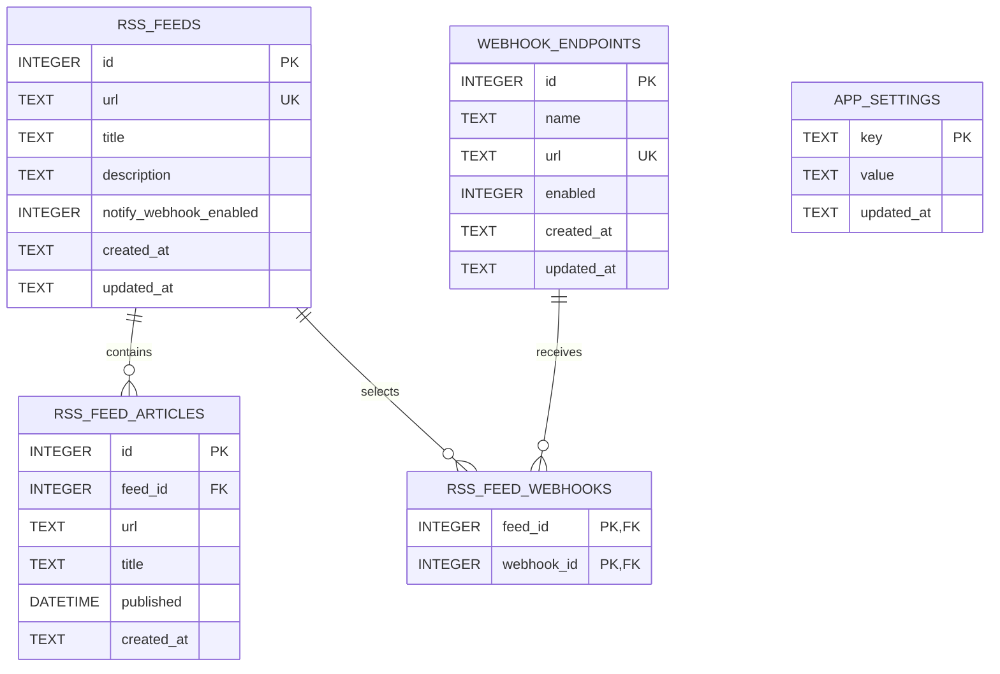

# DB 定義

`app_settings` で `rss_periodic_execution_enabled`、`rss_webhook_notification_enabled`、`webhook_include_summary_enabled` に加え、`llm_provider`、`llm_base_url`、`llm_api_key`、`llm_model` を保持する。LLM API key はAPIレスポンスへ返さない。ブックマーク、フォルダ、タグ、ニュースサイトのテーブルは現行スキーマに存在しない。
