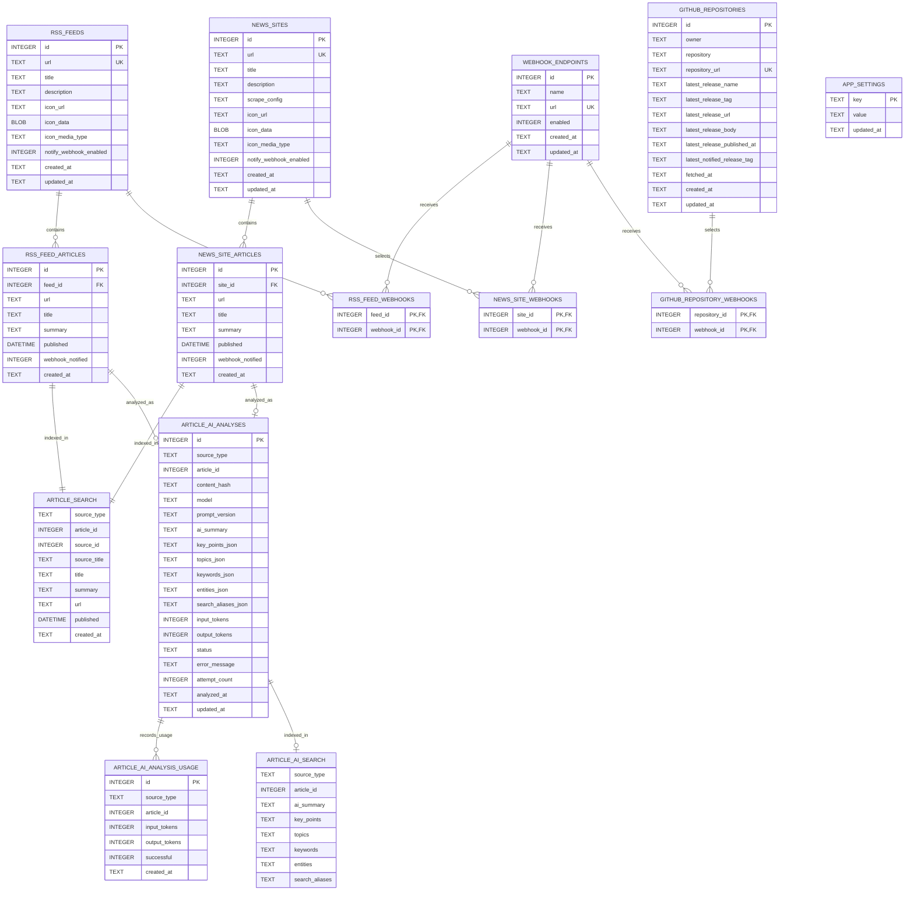

# DB 定義

`rss_feeds` と `news_sites` のアイコンは、外部画像の場合は `icon_url` のみ、アップロードの場合は公開用API URLと `icon_data` / `icon_media_type` を保持する。`rss_feed_articles.published` はRSS XMLの公開日時をISO 8601形式で保持し、XMLに含まれるUTCオフセットを維持する。`rss_feed_articles.webhook_notified` と `news_site_articles.webhook_notified` はWebhook通知キューの処理状態を表す。送信時は未処理記事から公開日時が新しい `webhook_max_articles_per_run` 件だけを通知し、1件以上の送信先への成功後に同じバックログ全体を処理済みにするため、上限から外れた古い記事は次回送信されない。送信失敗時は未処理のまま保持する。`app_settings` で `rss_periodic_execution_enabled`、`rss_webhook_notification_enabled`、`webhook_include_summary_enabled`、`webhook_max_articles_per_run` に加え、`llm_provider`、`llm_base_url`、`llm_api_key`、`llm_model`、AI記事解析の有効化・件数・日次トークン上限・対象期間を保持する。AI解析中は `ai_article_analysis_progress` に件数、現在の記事、トークン量、開始時刻のJSONスナップショットを一時保存し、終了時に削除する。LLM API key はAPIレスポンスへ返さない。ブックマーク、フォルダ、タグのテーブルは現行スキーマに存在しない。

`article_search` はFTS5の仮想テーブルで、通常RSSとカスタムRSSの記事タイトル、保存済みサマリー、フィード名を三文字単位で索引化する。記事の追加・更新・削除とフィード名変更はSQLiteトリガーで同期する。

`article_ai_analyses` は通常RSS・カスタムRSSの記事ごとに、`source_type` と `article_id` の組を一意として、入力内容のハッシュ、モデル、プロンプト版、AI要約、要点、トピック、キーワード、固有表現、多言語検索aliases、使用トークン、試行回数、成功・失敗状態とエラーを保持する。Topicsは固定大分類から最大2件、Keywordsは主題を表す3〜5件、Entitiesは中心的な固有名詞を最大5件、Key pointsは最大3件とする。検索aliasesは画面へ表示せず、日英の概念検索にだけ使用する。`article_ai_analysis_usage` は日次上限判定用に呼び出し単位の使用量を保持し、`article_ai_search` は成功した解析結果を三文字単位で索引化する。元記事の削除時は解析結果もトリガーで削除する。これらはSQLite上の論理的な関連であり、記事テーブルへの外部キー制約は持たない。

`github_repositories` はRSSデータとは独立し、登録リポジトリとGitHub APIから最後に取得した最新公開リリース1件をキャッシュする。`github_repository_webhooks` はリポジトリごとの通知先を保持し、未選択は通知無効を表す。`latest_notified_release_tag` はWebhook送信が1件以上成功した最後のタグを保持し、画面用キャッシュのタグとは分離して重複通知と通知漏れを防ぐ。
