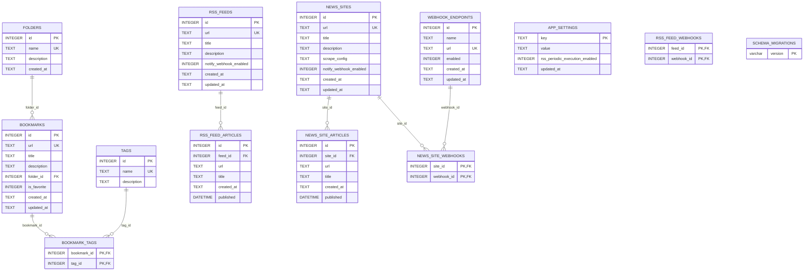

# DB 定義

このドキュメントは、現在の SQLite スキーマを Mermaid ER 図で表したものである。
詳細な API レスポンススキーマや制約は [API データと制約](../components/api/data-and-constraints.md) を参照する。

## ER 図

## リレーション

| From | To | Cardinality | Delete behavior |
| --- | --- | --- | --- |
| `bookmarks.folder_id` | `folders.id` | many-to-one | `ON DELETE SET NULL` |
| `bookmark_tags.bookmark_id` | `bookmarks.id` | many-to-one | `ON DELETE CASCADE` |
| `bookmark_tags.tag_id` | `tags.id` | many-to-one | `ON DELETE CASCADE` |
| `rss_feed_articles.feed_id` | `rss_feeds.id` | many-to-one | `ON DELETE CASCADE` |
| `rss_feed_webhooks.feed_id` | `rss_feeds.id` | many-to-one | `ON DELETE CASCADE` |
| `rss_feed_webhooks.webhook_id` | `webhook_endpoints.id` | many-to-one | `ON DELETE CASCADE` |
| `news_site_articles.site_id` | `news_sites.id` | many-to-one | `ON DELETE CASCADE` |
| `news_site_webhooks.site_id` | `news_sites.id` | many-to-one | `ON DELETE CASCADE` |
| `news_site_webhooks.webhook_id` | `webhook_endpoints.id` | many-to-one | `ON DELETE CASCADE` |

## 一意制約と index

| Name | Target | Purpose |
| --- | --- | --- |
| `idx_bookmarks_url_unique` | `bookmarks(url)` | ブックマーク URL の重複防止 |
| `idx_rss_feeds_url_unique` | `rss_feeds(url)` | RSS フィード URL の重複防止 |
| `idx_rss_feed_articles_feed_url_unique` | `rss_feed_articles(feed_id, url)` | 同一 feed 内の記事 URL 重複防止 |
| `idx_bookmarks_created_id` | `bookmarks(created_at DESC, id DESC)` | ブックマーク一覧の新着順 |
| `idx_bookmarks_folder_created_id` | `bookmarks(folder_id, created_at DESC, id DESC)` | フォルダ絞り込み一覧 |
| `idx_bookmarks_favorite_created_id` | `bookmarks(is_favorite, created_at DESC, id DESC)` | お気に入り一覧 |
| `idx_bookmark_tags_tag_bookmark` | `bookmark_tags(tag_id, bookmark_id)` | タグ絞り込み一覧 |
| `idx_rss_feeds_title_id` | `rss_feeds(title ASC, id ASC)` | RSS フィード一覧 |
| `idx_rss_feed_articles_feed_published_id` | `rss_feed_articles(feed_id, published DESC, id DESC)` | RSS 記事の published 順 |
| `idx_rss_feed_articles_feed_published_null_id` | `rss_feed_articles(feed_id, published IS NULL, published DESC, id DESC)` | published 未設定記事を含む RSS 記事一覧 |
| `idx_news_sites_url_unique` | `news_sites(url)` | custom news site URL の重複防止 |
| `idx_news_sites_title_id` | `news_sites(title ASC, id ASC)` | custom news site 一覧 |
| `idx_news_site_articles_site_url_unique` | `news_site_articles(site_id, url)` | 同一 site 内の記事 URL 重複防止 |
| `idx_news_site_articles_site_published_id` | `news_site_articles(site_id, published DESC, id DESC)` | scraped article の published 順 |

## 設定値

`app_settings` はアプリ全体設定を保持する key-value テーブルである。

| Key | Meaning |
| --- | --- |
| `rss_periodic_execution_enabled` | batch による RSS 定期実行の有効/無効 |
| `rss_webhook_notification_enabled` | batch 実行時の webhook 通知の有効/無効 |
| `webhook_include_summary_enabled` | 全 webhook 通知に記事サマリーを含めるか。未設定時は有効 |
| `llm_provider` | `ollama`、`vllm`、`openai` の provider 識別子 |
| `llm_base_url` | LLM HTTP endpoint の base URL |
| `llm_api_key` | LLM credential（API レスポンスでは非公開） |
| `llm_model` | chat completion に使用する model |

RSS 手動実行や batch 通知で使う webhook URL は `webhook_endpoints` テーブルで複数管理する。
以前のバージョンが使っていた `app_settings.default_webhook_url` は migration 時に `webhook_endpoints` へコピーされる。
