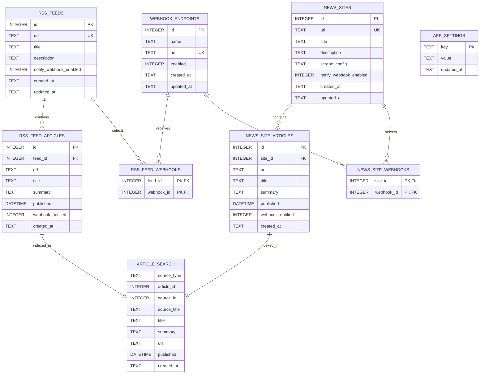

# DB 定義

`rss_feed_articles.published` はRSS XMLの公開日時をISO 8601形式で保持し、XMLに含まれるUTCオフセットを維持する。`rss_feed_articles.webhook_notified` と `news_site_articles.webhook_notified` は1件以上の送信先への通知成功後だけ真になる。未通知行はWebhook登録後の実行で再送対象になる。`app_settings` で `rss_periodic_execution_enabled`、`rss_webhook_notification_enabled`、`webhook_include_summary_enabled` に加え、`llm_provider`、`llm_base_url`、`llm_api_key`、`llm_model`、AI記事解析の有効化・件数・日次トークン上限・対象期間を保持する。LLM API key はAPIレスポンスへ返さない。ブックマーク、フォルダ、タグのテーブルは現行スキーマに存在しない。

`article_search` はFTS5の仮想テーブルで、通常RSSとカスタムRSSの記事タイトル、保存済みサマリー、フィード名を三文字単位で索引化する。記事の追加・更新・削除とフィード名変更はSQLiteトリガーで同期する。

`article_ai_analyses` は通常RSS・カスタムRSSの記事ごとに、入力内容のハッシュ、モデル、プロンプト版、AI要約、要点、トピック、キーワード、固有表現、使用トークン、成功・失敗状態を保持する。`article_ai_analysis_usage` は日次上限判定用に呼び出し単位の使用量を保持し、`article_ai_search` は成功した解析結果を三文字単位で索引化する。元記事の削除時は解析結果もトリガーで削除する。
